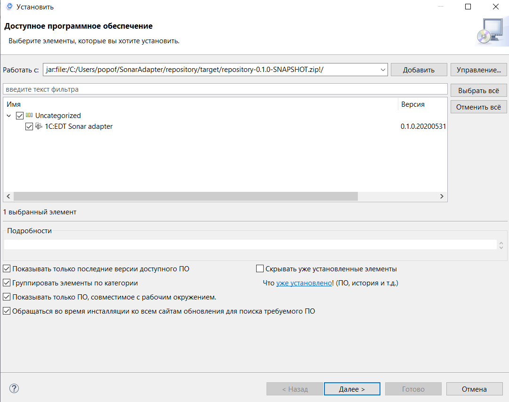

# EDT SonarQube Adapter

## Для чего?

Sonar Qube может выступать ветриной для замечаний различных статических анализаторов:

* АПК
* BSL-LS
* любой другой анализатор

Эти замечания чаще всего привязаны к конкретным строкам.

Плагин загружает замечания с сервера SonarQube и позволяет выполнять навигацию по ним.

Замечания, загруженные с севрера SonarQube, отображаются с префиксом 'sonar:'

## Установка

Скачать плагин по ссылке:

[https://github.com/popoffvg/EDTSonarAdapter/releases](https://github.com/popoffvg/EDTSonarAdapter/releases)

Выбрать скаченный файл как источник обновления:

## Рекомендации по применению

* Применяйте плагин только для проверок, которые не могут выполняться онлайн.
* Настраивайте загрузку замечаний в отдельной рабочей области.

## Настройка загрузки замечаний

Настройка загрузки замечаний выполняется для каждого проекта отдельно.

Настройки расположены в настройках проекта (Alt + Enter) -> Sonar adapter.

Настройки:

|Настройка |Описание |
|:--|:--|
|Load Sinar issues|Если истина, то загружать замечания из Sonar.|
|Server adress|Адрес сервера.|
|Project|Ключ проекта в SonarQube.|
|Key|Зарезервированный параметр.|
|Excludes|Регулярное выражение.  Если задано, то замечания, удоволетворяющие условию не будут загружены.|
|Assign|Если задано, то будут загружены замечания для указанного пользователя.|